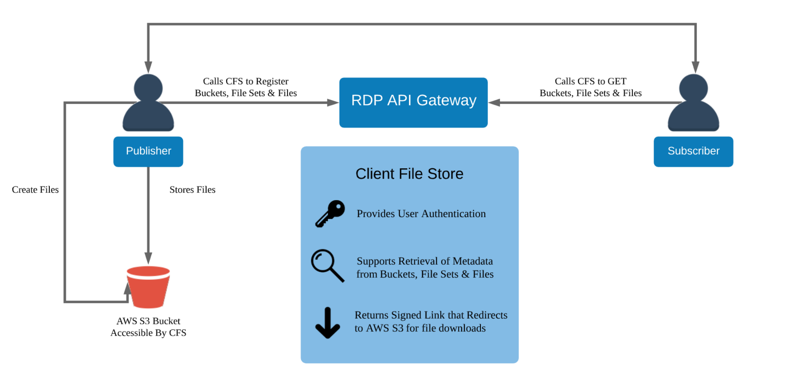

# A Step By Step Guide for Getting Municipal Market Monitor (TM3) Bulk File Using C#

## Overview

The Municipal Market Monitor (TM3) is a product providing US Municipal Bond information to clients. All the municipal market information collected from across the globe is consolidated and displayed in TM3 website.

To enhance scalability and leverage modern capabilities, TM3 is migrating its components to the Client File Store (CFS) within the [Delivery Platform](https://developers.lseg.com/en/api-catalog/refinitiv-data-platform/refinitiv-data-platform-apis) (aka Data Platform or RDP) on the cloud.

This article builds on my previous guide, [A Step-By-Step Workflow Guide for RDP Client File Store (CFS) API](https://developers.lseg.com/en/article-catalog/article/a-step-by-step-workflow-guide-for-rdp-client-file-store--cfs--ap), and focuses specifically on the TM3 file workflow. Based on client feedback that the original article was too complex for TM3 users, this version simplifies the process. Code examples are provided in [C#](https://learn.microsoft.com/en-us/dotnet/csharp/), but the HTTP-based workflow applies to any programming languages.

## Introduction to the RDP CFS API

Let’s start with the Client File Store service. The Client File Store (CFS) is a capability of [Delivery Platform](https://developers.lseg.com/en/api-catalog/refinitiv-data-platform/refinitiv-data-platform-apis) (aka Data Platform or RDP - formerly known as Refinitiv Data Platform) that provides authorization and enables access to content files stored in publisher repositories. LSEG provides various content file domains (aka *bucket*) for consumers such as:
- CFS ESG data
- Green Revenue data
- Symbology data
- Tick History
- Starmine
- Municipal Market Monitor (TM3)

And much more.

The Client File Store (CFS) is a component of the RDP which let consumers access via a set of HTTP RESTful APIs. 



The actual Bulk files are hosted on the Cloud (currently supports only [Amazon S3](https://aws.amazon.com/s3)). An application needs to interact with the RDP platform via RESTful APIs to get an actual file URL on the Cloud.

As part of the Delivery Platform, please see the following APIs resources: 
- [Quick Start](https://developers.lseg.com/en/api-catalog/refinitiv-data-platform/refinitiv-data-platform-apis/quick-start) page.
- [Tutorials](https://developers.lseg.com/en/api-catalog/refinitiv-data-platform/refinitiv-data-platform-apis/tutorials) page.
- [CFS API User Guide](https://developers.lseg.com/en/api-catalog/refinitiv-data-platform/refinitiv-data-platform-apis/documentation#cfs-api-user-guide) page.

That’s all I have to say about the CFS API and RDP.

## What You Need

Now we come to the prerequisite of getting the TM3 bulk file via the CFS API.

1. RDP Machine ID , Password, and App Key credential.
2. Access to RDP CFS API and TM3 file.
3. Your TM3 package ID.
4. C# development environment (.NET version 8).

Please contact your LSEG's representative or Account Manager to help you to access to RDP CFS API. 

## Overview of the TM3 CFS API Workflow

My next point is an overview of the workflow. An application's workflow can be summarized to the following steps:

1. **Log in to the RDP Authentication Service**

    Require: Machine ID, Password, App Key
    Retrieves: *access token*, *refresh token*, and *expires_in*.

2. **Query the File-Set**  

    Require: 

    - *access token* in HTTP Authentication header
    - *bucketname* = **bulk-Custom** (for TM3 data)  
    - *package_id* = Your package ID (ask your LSEG contact)  
    - *modifiedSince* = Only show files updated after this date  
    - *pageSize* = How many results to show (max 100)
    
    Retrieves:

    - Array in of Files information in JSON messages. The **File-Set** is in each **files** array of each message. 
    - Handles *@nextLink* for pagination (if the results are more than 100 entries).
        
3. **Get the actual File URLfrom the Cloud**  

    Require
        
    - *access token* in HTTP Authentication header
    - *File-Set* = selected File-Set from Step 2

4. **Download the file from the Actual URL**  

    Download the Bulk file using the actual URL from Step 3.

5. **Refresh Token before expires_in**  

    Require:App Key and refresh token
    Retrieves: *access token*, *refresh token*, and *expires_in*.

6. **Log out when done**  
   
   Require:App Key and access token


That covers an application workflow summary.

## <a id="application_code"></a>Application Source Code

To make this article not too complex, I am explaining the workflow with HTTP and C# snippet code only. You can check and download the full source code project from GitHub in 3 programming languages.

- [Full C# HTTP example](https://github.com/LSEG-API-Samples/Example.TM3.RDP.CSharp.Workflow)
- [Full Java HTTP example](https://github.com/LSEG-API-Samples/Example.TM3.RDP.Java.Workflow)
- [Full Python HTTP example](https://github.com/LSEG-API-Samples/Example.TM3.RDP.Python.Workflow)
- [Postman collection example](https://github.com/LSEG-API-Samples/Example.TM3.RDP.Postman.Workflow)

Please note that HTTP workflow above can be applied to any programming languages.

## <a id="rdp_workflow"></a>TM3 Bulk File C# Application Code Walkthrough

### Step 1: Authentication with RDP APIs

Now we come to the code walkthrough. Let’s start with the authentication. The first step of an application workflow is to login to RDP Auth Service. 

The required credential information is as follow:

- Username: The username/machine-id. 
- Password: Password associated with the username/machine-id. 
- Client ID (**AppKey**): A unique ID for your app, created using the App Key Generator. Keep it private.
- Grant Type **password**: This is for initial authentication request using username/password combination.

The HTTP request for the RDP APIs Authentication service is as follows:

``` HTTP
POST /auth/oauth2/v1/token HTTP/1.1
Accept: */*
Content-Type: application/x-www-form-urlencoded
Host: api.refinitiv.com:443
Content-Length: XXX

username=RDP_USERNAME/MACHINE_ID
&password=RDP_PASSWORD
&client_id=RDP_APP_KEY
&grant_type=password
&takeExclusiveSignOnControl=true
&scope=trapi
```

Example Code in C#:

The code uses C# [HttpClient](https://learn.microsoft.com/en-us/dotnet/api/system.net.http.httpclient?view=net-8.0) class to operate the HTTP POST request via *HttpClient.PostAsync()* method. Please be noticed that the **Content-Type** is in **application/x-www-form-urlencoded** format.

```C#
private static async Task<Token> Login(string machineid, string password, string appkey)
{
    string auth_url = $"{baseUrl}/auth/oauth2/v1/token";
    try
    {
        // Create HTTP Post Body Payload
        var payload = new FormUrlEncodedContent(new Dictionary<string, string>
        {
            { "username", machineid },
            { "password", password },
            { "client_id", appkey },
            { "grant_type", "password" },
            { "takeExclusiveSignOnControl", "true" },
            { "scope", "trapi" }
        });

        payload.Headers.ContentType = new MediaTypeHeaderValue("application/x-www-form-urlencoded");
        var httpclient = new HttpClient();
        // Send HTTP Post Message
        HttpResponseMessage response = await httpclient.PostAsync(auth_url, payload);

    }        
    catch (Exception e)
    {
        Console.WriteLine($"Request {auth_url}  error: {e.Message}");
    }

}
```

Once the authentication success, the function gets the RDP Auth service response message and keeps the following RDP token information in the variables.

- **access_token**: Used to get data from RDP APIs. Keep this safe for future requests.
- **refresh_token**: Used to get a new Access Token when the old one is about to expire.
- **expires_in**: How long (in seconds) the Access Token is valid.

Next, after the application received the Access Token (and authorization token) from RDP Auth Service, all subsequent REST API calls will use this token to get the data. Please find more detail regarding RDP APIs workflow in the following resources:

- [RDP APIs: Introduction to the Request-Response API](https://developers.lseg.com/en/api-catalog/refinitiv-data-platform/refinitiv-data-platform-apis/tutorials#introduction-to-the-request-response-api) page.
- [RDP APIs: Authorization - All about tokens](https://developers.lseg.com/en/api-catalog/refinitiv-data-platform/refinitiv-data-platform-apis/tutorials#authorization-all-about-tokens) page.


The code gets the response message from *HttpClient.PostAsync()* method. The response data is in JSON message format, so I am using [Newton soft JSON.NET](https://www.newtonsoft.com/json) to parse and get token information.

Example Code in C#:

```C#
private static async Task<Token> Login(string machineid, string password, string appkey)
{
    string auth_url = $"{baseUrl}/auth/oauth2/v1/token";
    try
    {
        //Create Request Message
        // Send HTTP Post Message
        HttpResponseMessage response = await httpclient.PostAsync(auth_url, payload);

        if (response.IsSuccessStatusCode)
        {
            Console.WriteLine($"Status Code: {(int)response.StatusCode}");
            Console.WriteLine($"Status Text: {response.ReasonPhrase}");
            var responseBody = await response.Content.ReadAsStringAsync();
            dynamic json = JsonConvert.DeserializeObject(responseBody);
            return new Token
            {
                AccessToken = json.access_token,
                RefreshToken = json.refresh_token,
                Expires_in = (int)json.expires_in
            };
        }
        else
        {
            //Handle Error
        }
    }
    //Handle Catch
    return new Token(); // Return empty token on failure
}
```

Now the token information (*access token*, *refresh token*, and *expires_in*) is in the *Token* object.

### <a id="rdp_get_data"></a>Requesting Data from RDP APIs

That brings us to requesting the RDP APIs data. Every subsequent API request must include this token in the Authorization header like this:

- Header: 
    * Authorization = ```Bearer <RDP Access Token>```

**Please notice *the space* between the ```Bearer``` and ```RDP Access Token``` values**.

If the token is still valid and has appropriate scope, the request is allowed to access the data.

## Step 2: Listing the FileSets using the Bucket Name and Package ID with PageSize=100 and ModifiedSince

The next step is to getting the FileSets information. The application needs to send an HTTP GET request to the RDP **/file-store/v1/file-sets?bucket={bucket-name}&packageId={packageId}&pageSize=100&modifiedSince={modifiedSince}** endpoint to list all FileSets under the input **bucket-name** (always **bulk-Custom** for TM3) and **packageId**.

The required information in the request message is as follows:

- An access token in HTTP request message header
- bucket-name = **bulk-Custom** for TM3 files
- package-id =Your package ID (provided by your LSEG contact)
- pageSize = 100 (returns up to 100 entries; default is 25)
- modifiedSince = Only returns FileSets modified after this timestamp (example *2025-09-12T12:00:00Z*)

The HTTP Request structure is as follows:

``` HTTP
GET /file-store/v1/file-sets?bucket=bulk-Custom&packageId={packageId} HTTP/1.1
Host: api.refinitiv.com
Authorization: Bearer <Access Token>
```

I am using the **bulk-Custom** bucket name with my test package-id *41c7-5071-e124b4b7-a663-0c40a5c74a6d* to get the TM3 file. **Your package-id will be different**. 

The code use *HttpClient.GetAsync()* method to send HTTP request message.

Example Code in C#. 

```C#
private static async Task<string> QueryFileSetModifiedSince(string bucketname, string package_id, string access_token, string modifiedSince)
{
    
    // package_id = "41c7-5071-e124b4b7-a663-0c40a5c74a6d";
    // modifiedSince = "2025-09-12T12:00:00Z";
    string queryParams = $"?bucket=bulk-Custom&packageId={package_id}&pageSize=100&modifiedSince={Uri.EscapeDataString(modifiedSince)}";

    string fileset_url = $"{baseUrl}/file-store/v1/file-sets{queryParams}";

    try
    {
        var request = new HttpRequestMessage(HttpMethod.Get, fileset_url);

        var httpClient = new HttpClient();
        httpClient.DefaultRequestHeaders.Authorization = new AuthenticationHeaderValue("Bearer", access_token);

        Console.WriteLine($"Requesting FileSet using pageSize = 100 and modifiedSince = {modifiedSince}");
        // Send HTTP GET Message
        HttpResponseMessage response = await httpClient.GetAsync(fileset_url);

    }
    catch (Exception e)
    {
        Console.WriteLine($"Request {fileset_url} error: {e.Message}");
    }

    return ""; //in case error or empty data
}
```

The FileSets responses are in array of JSON message. Please note that a number of data entries can be **up to 100 entries per one response message**. The example response is shown below:

```json
{
    "value": [
        {
            "id": "41e8-b461-ad46ca0b-bbf8-cf6171fcfb4b",
            "name": "TESTDEVDATALIBRARY2025-09-12T09:00:00.000-04:00",
            "bucketName": "bulk-custom",
            "packageId": "41c7-5071-e124b4b7-a663-0c40a5c74a6d",
            "attributes": [],
            "files": [
                "45b8-da3e-12c87cd3-90aa-2eedd4ffc601"
            ],
            "numFiles": 1,
            "contentFrom": "2025-09-12T11:00:00Z",
            "contentTo": "2025-09-12T13:00:00Z",
            "availableFrom": "2025-09-12T13:01:17Z",
            "availableTo": "2026-03-12T13:01:16Z",
            "status": "READY",
            "created": "2025-09-12T13:01:17Z",
            "modified": "2025-09-12T13:01:19Z"
        },
        {
            "id": "46a6-1023-c8c8b578-8acc-099e8307a6dc",
            "name": "TESTDEVDATALIBRARY2025-09-12T11:00:00.000-04:00",
            "bucketName": "bulk-custom",
            "packageId": "41c7-5071-e124b4b7-a663-0c40a5c74a6d",
            "attributes": [],
            "files": [
                "4e24-0015-1b5f5321-ae10-c129e93d3b7d"
            ],
            "numFiles": 1,
            "contentFrom": "2025-09-12T13:00:00Z",
            "contentTo": "2025-09-12T15:00:00Z",
            "availableFrom": "2025-09-12T15:02:12Z",
            "availableTo": "2026-03-12T15:02:12Z",
            "status": "READY",
            "created": "2025-09-12T15:02:12Z",
            "modified": "2025-09-12T15:02:15Z"
        },
        {
            "id": "4aed-3224-cdd0d4d7-a49a-b7da7c90cffb",
            "name": "TESTDEVDATALIBRARY2025-09-12T13:00:00.000-04:00",
            "bucketName": "bulk-custom",
            "packageId": "41c7-5071-e124b4b7-a663-0c40a5c74a6d",
            "attributes": [],
            "files": [
                "4a73-df2b-465698a8-a7c0-417899a22cea"
            ],
            "numFiles": 1,
            "contentFrom": "2025-09-12T15:00:00Z",
            "contentTo": "2025-09-12T17:00:00Z",
            "availableFrom": "2025-09-12T17:01:38Z",
            "availableTo": "2026-03-12T17:01:38Z",
            "status": "READY",
            "created": "2025-09-12T17:01:38Z",
            "modified": "2025-09-12T17:01:41Z"
        },
		...
    ]
}
```

The File Set is in the **files** property of each file entry above.

```json
 {
    "id": "41e8-b461-ad46ca0b-bbf8-cf6171fcfb4b",
    "name": "TESTDEVDATALIBRARY2025-09-12T09:00:00.000-04:00",
    "bucketName": "bulk-custom",
    "packageId": "41c7-5071-e124b4b7-a663-0c40a5c74a6d",
    "attributes": [],
    "files": [
        "45b8-da3e-12c87cd3-90aa-2eedd4ffc601" <--- This is a File Set value
    ],
    "numFiles": 1,
    ...
}
```

I am using the [JArray](https://www.newtonsoft.com/json/help/html/T_Newtonsoft_Json_Linq_JArray.htm) class to access the JSON array, then get the first entry's FileSet (index = 0) as a demonstration FileSet (*45b8-da3e-12c87cd3-90aa-2eedd4ffc601* above).

```C#
private static async Task<string> QueryFileSetModifiedSince(string bucketname, string package_id, string access_token, string modifiedSince)
{
    // Parameters
    try
    {
        // Create request message
        // Send HTTP GET Message
        HttpResponseMessage response = await httpClient.GetAsync(fileset_url);

        if (response.IsSuccessStatusCode)
        {
            var responseBody = await response.Content.ReadAsStringAsync();
            dynamic json = JsonConvert.DeserializeObject(responseBody);
           
            JArray fileSetsArray = (JArray)json.value;

            if (fileSetsArray != null || !fileSetsArray.Any()) //file Return data is not empty
            {
                Console.WriteLine($"FileSets data since {modifiedSince} are {fileSetsArray}\n\n");
                Console.WriteLine("The File ID is in the files array. Select the one that you need.");
                Console.WriteLine("I am demonstrating with the first entry.");
                string FileSet = (string)fileSetsArray[0]["files"][0];
                Console.WriteLine($"The FileSet is {FileSet}\n\n");
                return FileSet;
            }
        }
        else
        {
            // Handle Error
        }
    }
    // Handle Catch

    return ""; //in case error or empty data
}
```

## Step 2.5: Paging

When you query the file-sets endpoint, the response may contain more than 100 entries. However, each response can only return up to 100 entries at a time.

If there are more than 100 entries, the response will include a special field called **@nextLink**, which provides the URL to fetch the next page of results. Here's an example response:

```json
{
    "value": [
        {
            "id": "400b-8bb5-f81cf6be-8b5c-43ad1ff03388",
            "name": "TESTDEVDATALIBRARY2025-09-16T13:00:00.000-04:00",
            "bucketName": "bulk-custom",
            "packageId": "41c7-5071-e124b4b7-a663-0c40a5c74a6d",
            "attributes": [],
            "files": [
                "494a-29a3-2b8448a9-8af5-b04afbd00b0c"
            ],
            "numFiles": 1,
            ...
        },
        ...
    ],
    "@nextLink": "/file-store/v1/file-sets?bucket=bulk-Custom&packageId=41c7-5071-e124b4b7-a663-0c40a5c74a6d&pageSize=100&skipToken=ZmlsZXNldElkPTQ1OGMtZWNmYi1jODEyMjk2YS1iNzllLWMxOTlmNTIzMjkzNQ"
}
```

You can get this **@nextLink** value from the **/file-store/v1/file-sets?bucket=bulk-Custom&packageId={packageId}&pageSize=100&modifiedSince={modifiedSince}** endpoint response message as follow.

```C#
private static async Task<string> QueryFileSetModifiedSince(string bucketname, string package_id, string access_token, string modifiedSince)
{
    // Parameters
    try
    {
        // Create request message
        // Send HTTP GET Message
        HttpResponseMessage response = await httpClient.GetAsync(fileset_url);

        if (response.IsSuccessStatusCode)
        {
            var responseBody = await response.Content.ReadAsStringAsync();
            dynamic json = JsonConvert.DeserializeObject(responseBody);
            if (json.ContainsKey("@nextLink"))
            {
                nextLink = json["@nextLink"];
            }
        }
     }
    // Handle Catch

    return ""; //in case error or empty data
}
```

Once you got the **@nextLink**, you can append it to **https://api.refinitiv.com:443** base URL endpoint and request the next (up to 100) data entries. Let's see the C# example code below.

```C#
private static async Task QueryFileSetPaging(string access_token, string nextLinkURL)
{
    string fileset_url = $"{baseUrl}{nextLinkURL}";
    try
    {
        var request = new HttpRequestMessage(HttpMethod.Get, fileset_url);

        var httpClient = new HttpClient();
        httpClient.DefaultRequestHeaders.Authorization = new AuthenticationHeaderValue("Bearer", access_token);

        Console.WriteLine("Requesting FileSet next paging");
        // Send HTTP GET Message
        HttpResponseMessage response = await httpClient.GetAsync(fileset_url);

        //Handle response the same Step 2
    }
    //...
}
```

**Important Note**: an application still need to send an access token in the request message header.

That’s all I have to say about how to get the File Set information.

## Step 3: Get the actual file URL on the Cloud

Now let me turn to getting the actual file URL on the Cloud (currently supports only Amazon AWS S3 service) with the RDP **/file-store/v1/files/{file ID}/stream** endpoint.

The HTTP Request structure is as follows:

``` HTTP
GET /file-store/v1/files/{fileId}/stream?doNotRedirect=true HTTP/1.1
Host: api.refinitiv.com
Authorization: Bearer <Access Token>
```

The code use *HttpClient.GetAsync()* method to send HTTP request message.

Example Code in C#.

```C#
private static async Task<string> QueryActualFileURL(string fileSet, string access_token)
{
    // fileSet from Step 2
    string file_url = $"{baseUrl}/file-store/v1/files/{fileSet}/stream?doNotRedirect=true";
    try
    {
        var request = new HttpRequestMessage(HttpMethod.Get, file_url);

        var httpClient = new HttpClient();
        httpClient.DefaultRequestHeaders.Authorization = new AuthenticationHeaderValue("Bearer", access_token);

        Console.WriteLine("Requesting actual file URL using FileSet");
        // Send HTTP GET Message
        HttpResponseMessage response = await httpClient.GetAsync(file_url);

        
    }
    // Handle Catch

    return string.Empty; //fail case
}
```

The response message is in JSON message format like an example below.

```json
{
    "url": "https://a206464-bulk-custom.s3.amazonaws.com/GE-11328/2025/09/16/TESTDEVDATALIBRARY2025-09-16T13%3A00%3A00.000-04%3A00?x-request-Id=4ed40ee9-ec73-4ee9-a149-f5c19c6aea71&x-package-id=41c7-5071-e124b4b7-a663-0c40a5c74a6d&x-client-app-id=bxxxx"
}
```

An actual URL of a bulk file is in the **url** field. You can use this URL to download the file directly from AWS S3.  

The example C# code to get this **url** field is shown below.

```C#
private static async Task<string> QueryActualFileURL(string fileSet, string access_token)
{
    // Parameters
    try
    {
        // Create request message
        HttpResponseMessage response = await httpClient.GetAsync(file_url);

        if (response.IsSuccessStatusCode)
        {
            string responseBody = await response.Content.ReadAsStringAsync();
            dynamic json = JsonConvert.DeserializeObject(responseBody);
            Console.WriteLine($"{responseBody}\n\n");
            if (json.ContainsKey("url"))
            {
                Console.WriteLine("The Actual File URL is in the ```url``` attribute of the response message.");
                Console.WriteLine($"The Actual File URL = {(string)json.url}\n\n");
                return (string)json.url;
            }
        }
    }
    
    // Handle Catch
    return string.Empty; //fail case
}
```

Now we get an actual file URL which is "*https://a206464-bulk-custom.s3.amazonaws.com/GE-11328/2025/09/16/TESTDEVDATALIBRARY2025-09-16T13%3A00%3A00.000-04%3A00?x-request-Id=4ed40ee9-ec73-4ee9-a149-f5c19c6aea71&x-package-id=41c7-5071-e124b4b7-a663-0c40a5c74a6d&x-client-app-id=bxxxx*" in my demonstration.

## Step 4: Downloading the file

That brings us to download the file. The download link (actual URL) will look like this:

```
https://XXXX.s3.amazonaws.com/XXX/YEAR/MONTH/DATE/{file_name}?x-request-Id={signature}
```

Examples: 

```
https://a206464-bulk-custom.s3.amazonaws.com/GE-11328/2025/09/16/TESTDEVDATALIBRARY2025-09-16T13%3A00%3A00.000-04%3A00?x-request-Id=signature 
```

An actual file name from the URL above is **TESTDEVDATALIBRARY2025-09-16T13_00_00.000-04_00**. Why does it look different?
In the URL, the character **_** is replaced with **%3A** escape character. To get the real file name, replace **%3A** with **_** (underscore).

An application must use the entire URL **exactly as it is** to download a bulk file. **Do not change anything in the link, or the download will fail due to a signature mismatch error.**

**Note**: 
- If you cannot download the file, please wait for a while and then retry download the file from the URL. Please do not flush the download requests. 

Example Code in C#

```C#
private static async Task DownloadFile(string actualFileURL)
{
    try
    {
        // ...
        // Get actual File  Name
        string fileName = actualFileURL.Split("?")[0].Split("/")[^1].Replace("%3A", "_");
        // File Destination part (will be on \TM3Console\bin\Debug\net8.0 folder.
        string destinationPath = $"./{fileName}";

        var httpClient = new HttpClient();
        //Download the file
        byte[] fileBytes = await httpClient.GetByteArrayAsync(actualFileURL);
        await File.WriteAllBytesAsync(destinationPath, fileBytes);
        Console.WriteLine($"Download {destinationPath} complete.\n\n");
    }
    catch (Exception e)
    {
        Console.WriteLine($"Request {actualFileURL} error: {e.Message}");
    }
}
```

The TM3 bulk file will be downloaded to **TM3Console\bin\Debug\net8.0** folder.

Example application output:

```bash
### Step 4: Downloading the actual file from the Cloud
Once you got an actual URL. You can download the bulk file using that URL (**as is**).
**Do not alter or make any changes to the URL text string**
Please do not flush download requests.
You can choose to save that file with whatever name you want.
The actual file name is available on the Cloud URL as follows:
https://XXXX.s3.amazonaws.com/XXX/YEAR/MONTH/DATE/{file_name}?x-request-Id={signature}
The actual file name has been replace a ```_``` (underscore) with ```%3A``` escape character, so an application need to replace it backward.
Download ./TESTDEVDATALIBRARY2025-09-12T09_00_00.000-04_00 complete.
```

Now you get the TM3 file that you can extract and read the file.

That covers how to download the TM3 file via the RDP APIs.

### Step 5: Refresh Token with RDP APIs

My next point is how to extend the login session with RDP. Before the session expires (check the **expires_in** parameter, in seconds) , an application needs to request a new access token. To do this, it must send a Refresh Grant request to the RDP Authentication service. This ensures the app can continue making requests to the platform without interruption.

You can refresh token via the **/auth/oauth2/v1/token** endpoint (the same one as initial login request), and it must include:

- Refresh Token: The current Refresh Token value from the previous authentication
- Client ID (**AppKey**): A unique ID for your app, created using the App Key Generator. Keep it private.
- Grant Type: Use **refresh_token** to indicate you’re requesting a new access token.

The HTTP request for refreshing a token looks like this:

``` HTTP
POST /auth/oauth2/v1/token HTTP/1.1
Accept: */*
Content-Type: application/x-www-form-urlencoded
Host: api.refinitiv.com:443
Content-Length: XXX

refresh_token={current_refresh_token}
&grant_type=refresh_token
&client_id=RDP_APP_KEY
```
#### Caution: API Limit

The RDP Authentication service has the API limit described on the [RDP APIs: Limitations and Guidelines for the RDP Authentication Service](https://developers.lseg.com/en/article-catalog/article/limitations-and-guidelines-for-the-rdp-authentication-service) article.  If the application flushes the authentication request messages (both **password** and **refresh_token** grant_type) beyond the limit, the account will be blocked by the API Gateway. 

Example Code in C#:

```C#
private static async Task<Token> RefreshToken(string appkey, string refresh_token)
{
    string auth_url = $"{baseUrl}/auth/oauth2/v1/token";
    try
    {
        // Create HTTP Post Body Payload
        var payload = new FormUrlEncodedContent(new Dictionary<string, string>
        {
            { "refresh_token", refresh_token },
            { "client_id", appkey },
            { "grant_type", "refresh_token" }
        });

        payload.Headers.ContentType = new MediaTypeHeaderValue("application/x-www-form-urlencoded");
        var httpclient = new HttpClient();
        // Send HTTP POST Message
        HttpResponseMessage response = await httpclient.PostAsync(auth_url, payload);

        if (response.IsSuccessStatusCode)
        {
           
            Console.WriteLine("Refresh Token succeed");
            var responseBody = await response.Content.ReadAsStringAsync();
            dynamic json = JsonConvert.DeserializeObject(responseBody);
            
            return new Token
            {
                AccessToken = json.access_token,
                RefreshToken = json.refresh_token,
                Expires_in = (int)json.expires_in
            };
        }
    }
    // Handle Catch
    return new Token(); // Return empty token on failure
}
```

Once the request is successful, you’ll receive a response with **access_token**, **refresh_token**, and **expires_in** information. An application must keep those value for the next Refresh Token and API calls.

### Step 6: Revoke Token to ending the session.

We’re now at the final step: cleaning up resources.

This step makes sure that when a user logs out, switches accounts, or closes an application, that application tells the system its access tokens are no longer needed. By doing this, the system can safely remove any related data (like session details) and close the permissions that were granted earlier.

The **/auth/oauth2/v1/revoke** endpoint requires the following HTTP Header and Credential parameter information:

- Header: 
    * Authorization = **Basic <App Key+":" in Base64 format>**

- Body parameter
    * token: The current **Access Token** value from the previous RDP Authentication call

Please be noticed
  - The **":"** string after the **App Key**. 
  -  *the space* between the **Basic** and **App Key+":" in Base64** values.
  - The */revoke* endpoint does not use the **password** in a Basic Authorization, so we need to send empty password in **AppKey:** format.

The HTTP request for the RDP APIs Authentication service is as follows:

``` HTTP
POST /auth/oauth2/v1/revoke HTTP/1.1
Accept: */*
Content-Type: application/x-www-form-urlencoded
Host: api.refinitiv.com:443
Authorization: Basic <App Key+":" in Base64>
Content-Length: XXX

token={current_Access_token}
```

The HTTP request above can be written in C# as follows:

```C#
private static async Task RevokeToken(string appkey, string access_token)
{
    // Prepare URL and payload
    string auth_url = $"{baseUrl}/auth/oauth2/v1/revoke";
            
    try
    {
        string password = String.Empty; //Empty String Password
        string credentials = $"{appkey}:{password}";
        string base64EncodedCredentials = Convert.ToBase64String(Encoding.ASCII.GetBytes(credentials));

        // Create HTTP Post Body Payload
        var payload = new FormUrlEncodedContent(new Dictionary<string, string>
        {
            { "token", access_token }
        });

        payload.Headers.ContentType = new MediaTypeHeaderValue("application/x-www-form-urlencoded");

        var httpclient = new HttpClient();

        httpclient.DefaultRequestHeaders.Authorization = new AuthenticationHeaderValue("Basic", base64EncodedCredentials);
        // Send HTTP POST Message
        HttpResponseMessage response = await httpclient.PostAsync(auth_url, payload);

        if (response.IsSuccessStatusCode)
        {
            // Log Out is successful
        }
       
    }
    // Handle Catch
}
```

That’s all I have to say about the TM3 bulk file via RDP CFS API workflow.

## Troubleshooting

Please see the list of common issues and their answers on [CFS Bulk File/TM3 Q&A](https://community.developers.refinitiv.com/categories/cfs-bulk-file-tm3) forum.

## Next Steps

That brings me to the end of this CFS API workflow project. The CFS API is a powerful API that allows developers to download the content file dynamically via a straightforward sequence of HTTP RESTful API calls. The demonstration code is written in C# but the concept of the API calls steps are the same for other programming languages.

At the same time, the [Delivery Platform (RDP) APIs](https://developers.lseg.com/en/api-catalog/refinitiv-data-platform/refinitiv-data-platform-apis) provide various LSEG data and content for developers via an easy-to-use Web-based API. The APIs are easy to integrate into any application and platform that supports the HTTP protocol and JSON message format. 

You may interested in the following resources for more detail about the CFS data usage:

- [A Step-By-Step Workflow Guide for any Bulk Files with Client File Store (CFS) API](https://developers.lseg.com/en/article-catalog/article/a-step-by-step-workflow-guide-for-rdp-client-file-store--cfs--ap)
- [How to use File Notification Message Distribution for any Bulk Files with the Client File Store (CFS) Service](https://developers.lseg.com/en/article-catalog/article/how-to-use-file-notification-message-distribution-with-the-cfs-s)

And much more on the [Developer Portal](https://developers.lseg.com/en) website.

## <a id="references"></a>References

For further details, please check out the following resources:

- [Delivery Platform (RDP) APIs page](https://developers.lseg.com/en/api-catalog/refinitiv-data-platform/refinitiv-data-platform-apis) on the [LSEG Developer Community](https://developers.lseg.com/) website.
- [RDP APIs Playground page](https://apidocs.refinitiv.com/Apps/ApiDocs).
- [RDP APIs: Introduction to the Request-Response API](https://developers.lseg.com/en/api-catalog/refinitiv-data-platform/refinitiv-data-platform-apis/tutorials#introduction-to-the-request-response-api).
- [RDP APIs: Authorization - All about tokens](https://developers.lseg.com/en/api-catalog/refinitiv-data-platform/refinitiv-data-platform-apis/tutorials#authorization-all-about-tokens).
- [Limitations and Guidelines for the RDP Authentication Service](https://developers.lseg.com/en/article-catalog/article/limitations-and-guidelines-for-the-rdp-authentication-service) article.
- [Getting Started with Data Platform](https://developers.lseg.com/en/article-catalog/article/getting-start-with-refinitiv-data-platform) article.
- [CFS API User Guide](https://developers.lseg.com/en/api-catalog/refinitiv-data-platform/refinitiv-data-platform-apis/documentation#cfs-api-user-guide).
- [A Step-By-Step Workflow Guide for any Bulk Files with Client File Store (CFS) API](https://developers.lseg.com/en/article-catalog/article/a-step-by-step-workflow-guide-for-rdp-client-file-store--cfs--ap)
- [How to use File Notification Message Distribution for any Bulk Files with the Client File Store (CFS) Service](https://developers.lseg.com/en/article-catalog/article/how-to-use-file-notification-message-distribution-with-the-cfs-s)


For any questions related to Delivery Platform APIs, please use the  on the [Developers Community Q&A page](https://community.developers.refinitiv.com/).
